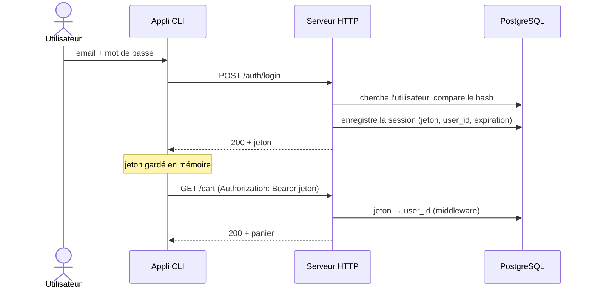

# Go-project

Plateforme e-commerce en ligne de commande, avec une application **client** et une application **administrateur** séparées, qui communiquent avec un **serveur HTTP** en Go.

## Technologie

- Golang (version **1.22 minimum**)
- PostgreSQL (conteneur Docker)
- `net/http` pour le serveur HTTP (sans framework)
- `database/sql` pour la persistance (sans ORM), avec le driver `pgx`
- Charmbracelet : `bubbletea`, `bubbles`, `huh`, `lipgloss`, `wish` (SSH)
- Package standard `flag` pour les options des programmes
- Architecture : **clean architecture** (version légère) côté serveur
- Configuration : fichier `.env`, injecté par Docker Compose, lu avec `os.Getenv`

## Architecture

### Schéma du flux

```
                 (1) accès                  (2) HTTP + JSON               (3) SQL
Utilisateur ───────────────────> Appli CLI ─────────────────> Serveur Go ─────────────> PostgreSQL
            terminal local       bubbletea     + jeton        net/http    database/sql   (Docker)
            ou SSH (wish)
```

- **(1) Utilisateur → CLI** : en local ou à distance en SSH. C'est la **même appli** dans les deux cas.
- **(2) CLI → Serveur** : requêtes HTTP en JSON. Une fois connecté, le jeton est envoyé dans l'en-tête `Authorization`.
- **(3) Serveur → BDD** : seul le serveur parle à PostgreSQL. Les CLI ne touchent **jamais** la base.

### Clean architecture du serveur

```
┌──────────────────────────────────────────────────────┐
│ adapter : httpserver (net/http), postgres (SQL)       │
│   ┌──────────────────────────────────────────────┐   │
│   │ usecase : cas d'utilisation + interfaces      │   │
│   │   ┌──────────────────────────────────────┐   │   │
│   │   │ domain : entités + règles métier      │   │   │
│   │   └──────────────────────────────────────┘   │   │
│   └──────────────────────────────────────────────┘   │
└──────────────────────────────────────────────────────┘
        Les dépendances pointent toujours vers l'intérieur.
```

- **domain** : les entités (`User`, `Product`, `Cart`, `Order`) et les règles métier. Aucune dépendance à HTTP ni à SQL.
- **usecase** : les actions de l'application (« ajouter au panier », « valider le panier »). Définit les interfaces des repositories dont il a besoin.
- **adapter** : ce qui parle au monde extérieur. `httpserver` reçoit les requêtes, `postgres` implémente les repositories.
- **cmd** : assemble le tout au démarrage et lit les options de la ligne de commande.

Exemple, « ajouter un produit au panier » :

```
tui/client → apiclient → POST /cart/items → httpserver → usecase/carts → domain/cart (règles) → postgres/carts → PostgreSQL
```

### Flux d'authentification



## Structure des dossiers

```
go-project/
├── go.mod
├── docker-compose.yml            ← PostgreSQL + serveur HTTP
├── Dockerfile                    ← image du serveur HTTP
├── .env.example                  ← modèle de configuration (à copier en .env)
├── sql/
│   ├── init.sql                  ← schéma + contraintes
│   └── seed.sql                  ← données de test
├── cmd/                          ← points d'entrée (un dossier par programme)
│   ├── server/                   ← commandes : serve, create-admin
│   ├── client/                   ← lance l'interface client
│   ├── admin/                    ← lance l'interface admin
│   └── ssh/                      ← lance le serveur SSH (wish)
└── internal/
    ├── domain/                   ← entités + règles métier (aucune dépendance externe)
    │   ├── user.go
    │   ├── category.go
    │   ├── product.go
    │   ├── cart.go
    │   ├── order.go
    │   ├── payment.go
    │   └── errors.go
    ├── usecase/                  ← cas d'utilisation + interfaces des repositories
    │   ├── auth.go
    │   ├── users.go
    │   ├── categories.go
    │   ├── products.go
    │   ├── carts.go
    │   ├── orders.go
    │   └── payments.go
    ├── adapter/
    │   ├── postgres/             ← implémentation des repositories (database/sql)
    │   └── httpserver/           ← handlers, middlewares, routes (net/http)
    ├── dto/                      ← structs JSON échangées (le contrat de l'API)
    ├── apiclient/                ← client HTTP utilisé par les CLI
    ├── ids/                      ← générateur PDT- / BSK- / CMD-
    └── tui/
        ├── client/               ← écrans bubbletea du client
        ├── admin/                ← écrans bubbletea de l'admin
        └── styles/               ← styles lipgloss communs
```

Règles de dépendance :

- `domain` n'importe **rien** du projet
- `usecase` importe uniquement `domain`
- `adapter` importe `usecase` et `domain`
- `cmd` assemble tout
- Côté CLI : `tui` → `apiclient` → `dto`. Le package `tui` n'importe **jamais** `domain`, `usecase` ni `adapter`

### Fonctionnalités

#### Fonctionnalités AUTH Utilisateur

| Nom | Catégorie | Description |
|---|---|---|
| Auth | Register | Je dois pouvoir m'inscrire avec un **email** et un **mot de passe** |
| Auth | Confirm | Je dois pouvoir confirmer mon inscription via un **code de confirmation unique et aléatoire** |
| Auth | Login | Je dois pouvoir me connecter avec un **email** et un **mot de passe** |
| Auth | Password forgot | Je dois pouvoir réinitialiser mon mot de passe **sans être connecté**, à partir de mon **adresse email** |
| Auth | Logout | Je dois pouvoir me déconnecter (la session est supprimée côté serveur) |

#### Fonctionnalités PRODUIT Utilisateur

| Nom | Catégorie | Description |
|---|---|---|
| Product | Search | Je dois être capable de chercher un produit via son **nom**, son **prix**, sa **description**, sa **catégorie** ou son **prix TTC** |

#### Fonctionnalités PANIER Utilisateur

| Nom | Catégorie | Description |
|---|---|---|
| Cart | Add | Je dois pouvoir **ajouter** un ou plusieurs produits dans mon panier |
| Cart | Update | Je dois pouvoir **modifier** la quantité d'un ou plusieurs produits |
| Cart | Remove | Je dois pouvoir **supprimer** un ou plusieurs produits du panier |
| Cart | Read | Je dois pouvoir **afficher** mon panier et son **total TTC** (**les frais de livraison sont toujours gratuits**) |

#### Fonctionnalités PRODUIT Administrateur

| Nom | Catégorie | Description |
|---|---|---|
| Product | Add | En tant qu'administrateur, je dois pouvoir ajouter un produit. En plus des propriétés d'un produit, un **identifiant métier** doit être généré (PDT-7D2K8N) |
| Product | Read | En tant qu'administrateur, je dois voir la liste de tous les produits |
| Product | Update | En tant qu'administrateur, je dois pouvoir modifier les propriétés d'un produit |
| Product | Remove | En tant qu'administrateur, je dois pouvoir supprimer un produit (**archivage** s'il a déjà été commandé) |

#### Fonctionnalités CATÉGORIES Administrateur

| Nom | Catégorie | Description |
|---|---|---|
| Category | Add | En tant qu'administrateur, je dois pouvoir ajouter une catégorie |
| Category | Read | En tant qu'administrateur, je dois voir la liste des catégories |
| Category | Update | En tant qu'administrateur, je dois pouvoir renommer une catégorie |
| Category | Remove | En tant qu'administrateur, je dois pouvoir supprimer une catégorie **non utilisée** par un produit |

#### Fonctionnalités PAIEMENT Utilisateur

| Nom | Catégorie | Description |
|---|---|---|
| Payment | Pay | En tant qu'utilisateur, je dois être capable de **payer un panier sauvegardé**. Je dois pouvoir **entrer mes informations bancaires : numéro de carte, date d'expiration et CVC**. Pas de branchement à Stripe. Un panier contient un **identifiant métier** (BSK-1KH8E7) |

#### Fonctionnalités COMMANDE Utilisateur

| Nom | Catégorie | Description |
|---|---|---|
| Order | Add | En tant qu'utilisateur, je dois pouvoir **valider mon panier** : une commande **en attente** est créée avec les produits du panier et un **identifiant métier unique** (CMD-1F2S8B), puis je la paie |
| Order | Read | En tant qu'utilisateur, je dois pouvoir **afficher mes commandes** et leur **statut** (en attente, payée, en cours de livraison, livrée, annulée avec la raison). Une commande contient, en plus des produits, **la date** et son **identifiant métier** |
| Order | Pay | En tant qu'utilisateur, je dois pouvoir payer une commande **en attente** (y compris une commande créée par un admin) |
| Order | Cancel | En tant qu'utilisateur, je dois pouvoir annuler ma commande en fournissant une **raison**, reportée sur la commande |

#### Fonctionnalités COMMANDE Administrateur

| Nom | Catégorie | Description |
|---|---|---|
| Order | Read | En tant qu'administrateur, je dois pouvoir voir toutes les commandes : statut, client, produits, identifiant |
| Order | Add | En tant qu'administrateur, je dois pouvoir créer une commande pour n'importe quel client, en liant un ou plusieurs produits et un utilisateur |
| Order | Modify | En tant qu'administrateur, je dois pouvoir changer le statut d'une commande |
| Order | Remove | En tant qu'administrateur, je dois pouvoir supprimer la commande de n'importe qui |

#### Fonctionnalités GESTION DES UTILISATEURS Administrateur

| Nom | Catégorie | Description |
|---|---|---|
| User | Add | En tant qu'administrateur, je dois pouvoir ajouter des utilisateurs |
| User | Update | En tant qu'administrateur, je dois pouvoir modifier n'importe quel utilisateur |
| User | Remove | En tant qu'administrateur, je dois pouvoir supprimer n'importe quel utilisateur (**anonymisation** s'il a déjà passé des commandes) |
| User | Confirm | En tant qu'administrateur, je dois pouvoir confirmer des comptes utilisateurs |
| User | Read | En tant qu'administrateur, je dois pouvoir voir la liste de tous les utilisateurs avec leur email et s'ils sont confirmés ou non |

## Règles métier

> Les règles métier sont codées dans `internal/domain` (règles sur une entité) et `internal/usecase` (règles qui demandent d'interroger la base). Jamais dans les handlers ni dans les écrans.

### Comptes et authentification

- L'email est **unique** et **normalisé** (minuscules, sans espaces) avant d'être enregistré ou comparé
- Le mot de passe fait au moins 8 caractères et n'est **jamais stocké en clair** (hash uniquement)
- Le code de confirmation est généré avec `crypto/rand`, est **à usage unique** et **expire après 15 min**
- Un compte **non confirmé ne peut pas se connecter**
- Pas de connexion automatique : après l'inscription et la confirmation, l'utilisateur **doit se connecter** avec son email et son mot de passe
- Le code de réinitialisation est à usage unique et **expire après 15 min**
- Une session **expire après 24 h** ; la déconnexion supprime la session
- La demande de réinitialisation renvoie le **même message**, que l'email existe ou non
- Les codes ne sont pas envoyés par email : ils sont **affichés dans les logs du serveur**
- Un compte créé par un admin peut être confirmé directement
- Un admin ne peut pas se supprimer lui-même
- Suppression d'un utilisateur : suppression réelle s'il n'a **aucune commande**, sinon **anonymisation** (email remplacé, connexion impossible, sessions et panier supprimés, commandes en attente annulées avec la raison « Compte supprimé », autres commandes conservées)
- Le premier admin est créé avec la commande `server create-admin`
- Toutes les dates sont fixées par le serveur, en UTC, et affichées en heure de Paris

### Produits

- La référence `PDT-XXXXXX` est **générée par le serveur**, jamais fournie par le client
- Le nom est obligatoire, le prix est **strictement positif**
- Les prix sont en **centimes** (entiers), toujours affichés avec **deux chiffres après la virgule** (`1999` → `19,99 €`)
- L'admin saisit le **prix HT** ; le **prix TTC** est calculé par la base : `ROUND(HT × 1,2)`, au centime le plus proche, sur le prix unitaire (TVA constante de 20 %)
- Un produit a **exactement une catégorie**, choisie dans la liste gérée par l'admin
- Un produit déjà commandé **ne peut pas être supprimé** : il est **archivé**
- Un produit archivé n'apparaît plus dans la recherche et ne peut plus être ajouté au panier, mais reste visible dans les anciennes commandes
- Recherche : partielle et insensible à la casse sur le nom et la description, par catégorie, par intervalle (min/max) sur le prix HT et le prix TTC

### Catégories

- Le nom d'une catégorie est **unique** et enregistré en **minuscules**
- Une catégorie utilisée par au moins un produit **ne peut pas être supprimée**

### Panier

- **Un seul panier actif** par utilisateur, toujours lié à un compte
- Un panier a une référence unique `BSK-XXXXXX`
- Un même produit n'apparaît **qu'une fois** par panier : l'ajouter à nouveau augmente sa quantité
- La quantité est **au moins égale à 1** ; mettre 0 supprime la ligne
- Le **total TTC est calculé par le serveur**, jamais envoyé par le client : somme des (prix TTC unitaire × quantité), sans arrondi supplémentaire
- Les frais de livraison sont **toujours gratuits**
- Un utilisateur ne peut modifier **que son propre panier** (identifié par son jeton, jamais par un `user_id` envoyé)
- On ne peut pas valider un panier vide
- Après validation, le panier est **vidé**

### Paiement

- Numéro de carte : 16 chiffres (vérification de Luhn en bonus)
- Date d'expiration : format MM/AA, pas encore passée
- CVC : 3 chiffres
- **Aucune donnée bancaire n'est stockée** (au maximum les 4 derniers chiffres)
- On ne peut payer qu'une commande **en attente** : pas de double paiement

### Commandes

- Une commande a une référence unique `CMD-XXXXXX`
- La **date** est fixée par le serveur
- Les **prix et noms des produits sont recopiés** dans la commande au moment de la validation : l'historique ne change pas si un prix est modifié
- Un utilisateur ne voit **que ses propres commandes**
- L'annulation exige une **raison**, enregistrée sur la commande
- Les changements de statut suivent les transitions autorisées :

| Depuis | Vers | Par |
|---|---|---|
| En attente | Payée | Client (paiement) |
| En attente | Annulée | Client ou admin (avec raison) |
| Payée | En cours de livraison | Admin |
| Payée | Annulée | Client ou admin (avec raison) |
| En cours de livraison | Livrée | Admin |
| Livrée / Annulée | — | États finaux |

- Toute autre transition est refusée
- Pas de système de livraison (non demandé par le sujet) : c'est l'**admin** qui fait passer une commande à « en cours de livraison » puis à « livrée ». Dans un vrai projet, ce serait le logiciel du transporteur

## Contraintes

### Interface

- Application **client** en ligne de commande
- Application **administrateur** en ligne de commande, **séparée** de l'application client
- Communication via un **serveur HTTP** avec le module `net/http`, **sans framework**
- Accès par **client SSH**, en plus des clients terminal, pour la partie client et administrateur, avec accès à **toutes** les fonctionnalités
- Utiliser charm.land et ses composants (`bubbletea`, `bubbles`, `huh`, `lipgloss`) pour concevoir des interfaces réactives et vivantes

### BDD

- Persistance via le module `database/sql`, **sans autre framework**
- Base de données PostgreSQL (via un conteneur Docker) ou SQLite → **choix : PostgreSQL**

### Dépendances

- Aucun framework qui remplace `net/http` ou `database/sql` (Gin, Echo, Chi, GORM…)
- Bibliothèques courantes de l'écosystème Go autorisées (`pgx`, `bcrypt`…)

### Livrable

- Archive compressée au format **ZIP** déposée sur **MyGES** (pas de lien Git)
- Respect du **temps imparti** lors de la soutenance

#### Types d'utilisateur

| Type | Description |
|---|---|
| Visiteur | Utilisateur non connecté : peut s'inscrire, confirmer son compte, se connecter, réinitialiser son mot de passe |
| Utilisateur | Client connecté : recherche, panier, paiement, commandes |
| Administrateur | Accès à l'application admin : gestion des produits, catégories, commandes et utilisateurs |

## Lancer le projet

> À compléter au fur et à mesure.

```bash
cp .env.example .env                                  # crée sa configuration locale
docker compose up -d --build                          # lance PostgreSQL + le serveur HTTP
docker compose exec server server create-admin --email admin@shop.local   # crée un admin (mot de passe demandé)
go run ./cmd/client                                   # lance le CLI client (serveur par défaut : http://localhost:8080)
go run ./cmd/admin                                    # lance le CLI admin
go run ./cmd/ssh                                      # lance le serveur SSH (ports 23234 et 23235)
```

## Pénalités

- Le code écrit n'est pas maîtrisé ou ne peut pas être expliqué
- Utilisation abusive de l'intelligence artificielle
- Utilisation de frameworks en dehors de Charmbracelet
- Non-respect des fonctionnalités
- Dépassement du temps imparti lors de la soutenance
- Livrable absent sur MyGES
- Livrable sous la forme d'un lien Git et pas d'une archive compressée au format ZIP
- Participation inégale des membres du groupe à la soutenance et/ou au développement du code